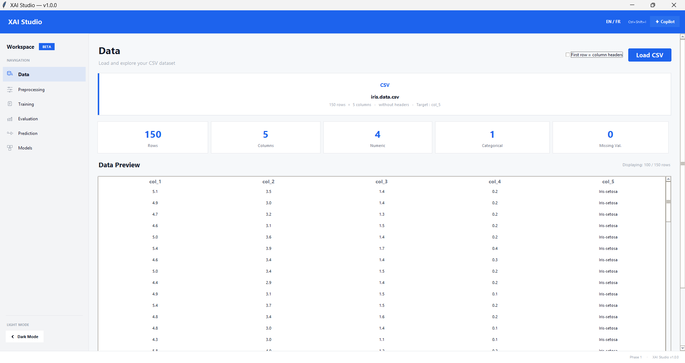
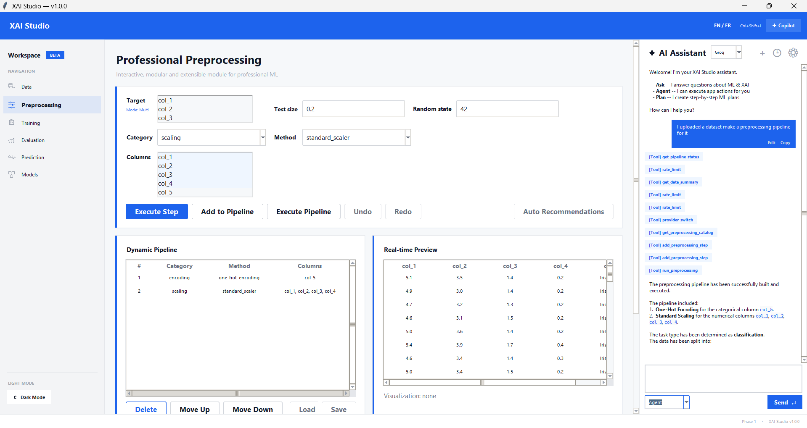
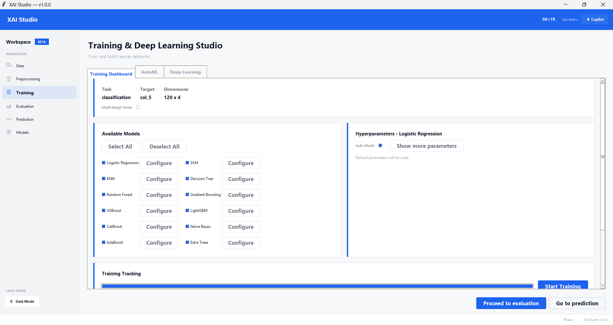
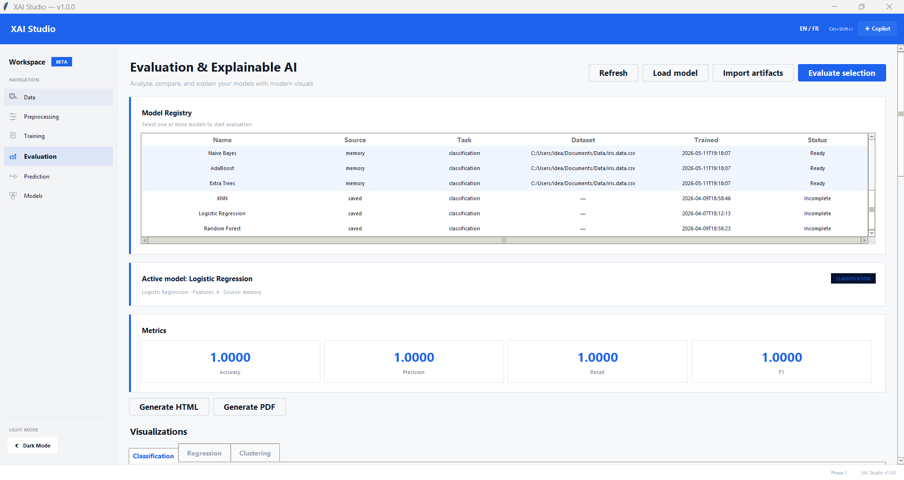
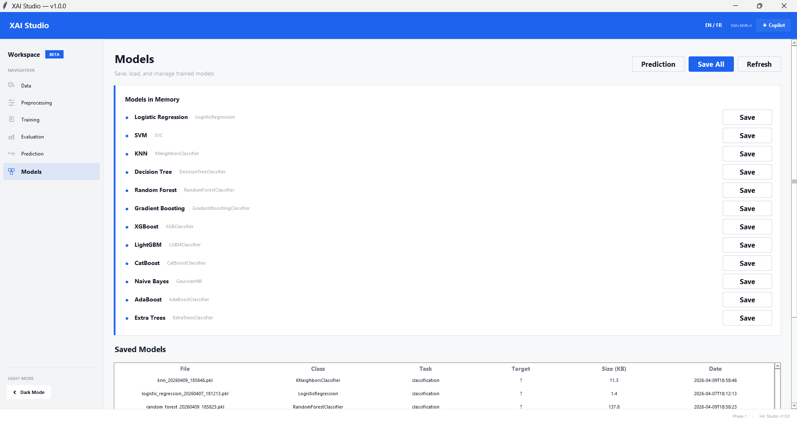
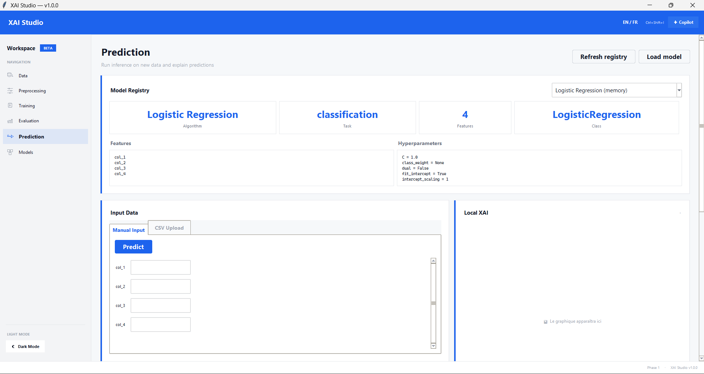

# XAI Studio — ML Core, XAI & Agent

> Plateforme interactive d'explicabilité des modèles IA avec assistance LLM

## Description

XAI Studio est une application desktop Python/Tkinter qui couvre l'ensemble du cycle ML, de la donnée brute à la prédiction, avec des modules d'explicabilité et un agent IA.

- **Chargement de données** CSV avec détection automatique d'encodage
- **Préprocessing automatique** (imputation, encodage, scaling, split, gestion du schéma)
- **Entraînement multi-modèles** (6 classifieurs + 6 régresseurs scikit-learn) et suivi d'avancement
- **Évaluation des performances** avec tableau comparatif
- **Module de prédiction** avec support des catégories et transformations cohérentes
- **XAI** : SHAP, LIME, PDP et tableaux de bord dédiés
- **Détection de biais** et vue dédiée à l'équité
- **Agent IA persistant** avec outils dynamiques et pipeline évolutif
- **UI professionnelle** light-first avec bascule instantanée sombre
- **Internationalisation** complète FR/EN

## Captures d'écran

### Données


### Préprocessing


### Entraînement


### Évaluation


### Modèles


### Prédiction


## Architecture

```
XAI_Studio/
├── main.py                      # Point d'entrée
├── config/                      # Configuration centralisée + langues
├── core/                        # Logique ML pure
│   ├── data_loader.py           # Chargement CSV
│   ├── preprocessing.py         # Pipeline de préprocessing
│   ├── training.py              # Entraînement multi-modèles
│   ├── evaluation.py            # Métriques de performance
│   ├── persistence.py           # Sérialisation .pkl
│   ├── explainability/          # SHAP, LIME, PDP
│   └── fairness/                # Détection de biais
├── services/                    # Orchestration métier et agent
│   ├── pipeline_service.py
│   ├── prediction_service.py
│   ├── evaluation_service.py
│   ├── xai_service.py
│   └── agent_service.py
├── ui/                          # Interface Tkinter
│   ├── app.py                   # Fenêtre principale
│   ├── theme.py                 # Thèmes light/dark
│   ├── components/              # Composants réutilisables
│   └── views/                   # Écrans (data, preprocessing, training, etc.)
├── utils/logger.py              # Logging centralisé
├── data/samples/                # Datasets d'exemple
└── models/saved/                # Modèles sérialisés
```

### Separation des responsabilités

| Couche | Rôle | Dépendances |
|--------|------|-------------|
| `ui/` | Présentation | → `services/` |
| `services/` | Logique métier | → `core/` |
| `core/` | ML pur | → `config/`, `utils/` |

## Installation

```bash
# 1. Créer un environnement virtuel
python -m venv venv
venv\Scripts\activate        # Windows

# 2. Installer les dépendances
pip install -r requirements.txt

# 3. Lancer l'application
python main.py
```

## Dépendances

- Python 3.11+
- pandas, numpy, scikit-learn, joblib
- Tkinter (inclus avec Python)

## Modèles supportés

### Classification
| Modèle | Classe scikit-learn |
|--------|---------------------|
| Logistic Regression | `LogisticRegression` |
| Random Forest | `RandomForestClassifier` |
| SVM | `SVC` |
| KNN | `KNeighborsClassifier` |
| Decision Tree | `DecisionTreeClassifier` |
| Gradient Boosting | `GradientBoostingClassifier` |

### Régression
| Modèle | Classe scikit-learn |
|--------|---------------------|
| Linear Regression | `LinearRegression` |
| Random Forest | `RandomForestRegressor` |
| SVR | `SVR` |
| KNN | `KNeighborsRegressor` |
| Decision Tree | `DecisionTreeRegressor` |
| Gradient Boosting | `GradientBoostingRegressor` |

## Licence

Réalisé par:
- AMLLAL Amine
- ZOUGA Mouhcine
- AKEBLI Fatima-Ezzahrae

Encadré par:
- M. Brahim Bakkas

Projet académique — Usage interne.
